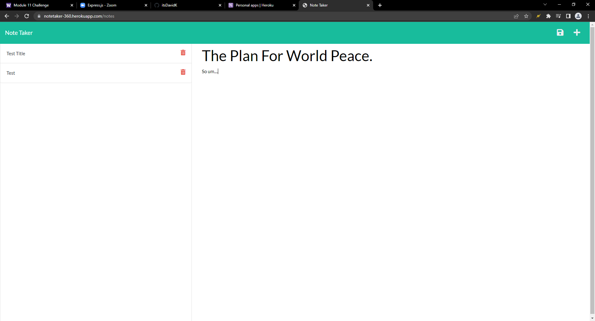

# notetaker
## Description
    
notetaker is program where the user name write a note and save it. The user can comeback to the site whenever they can, and the note will still be there unless a user deletes the note. The site is running on a heroku server.
## Table of Contents
- [Contributions](#contributions) 
- [Website Screenshot](#Website Screenshot)
- [Link to the Page](#Link to the Page)
- [Questions](#questions) 
## Contributions

David Kovalchuk

## Website Screenshot

## Link to the Page
https://notetaker-360.herokuapp.com/notes

## Questions
You can reach me on GitHub at [itsDavidK](https://github.com/itsDavidK).
